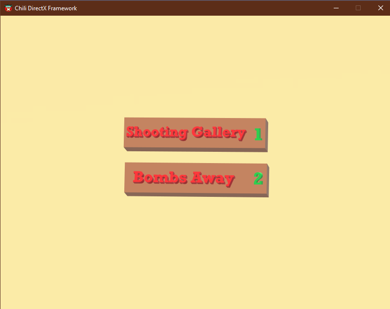
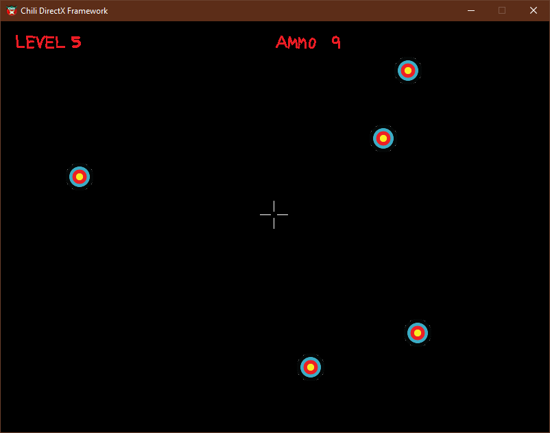
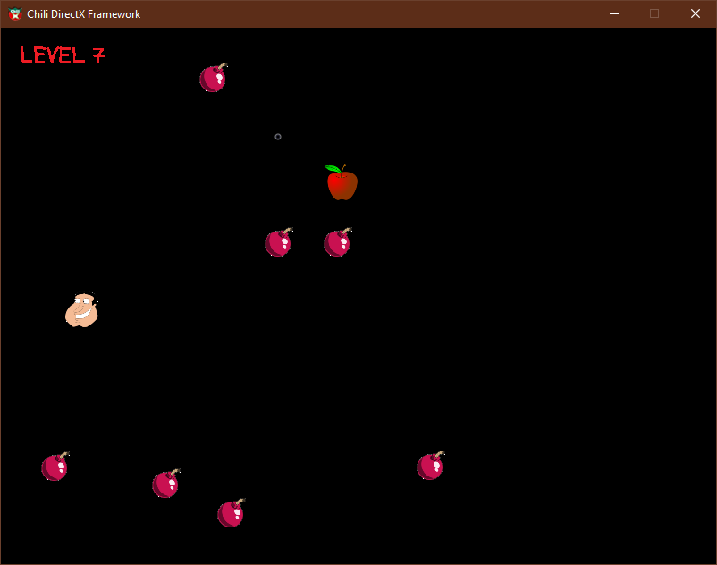

# DirectX 11 Game

A simple game made with DirectX 11 and Chili Framework (thanks to the amazing [ChiliTomatoNoodle](https://www.youtube.com/@ChiliTomatoNoodle)).

To run it, open it with Visual Studio (I used Community Edition 2022) and build it. Or ask me for a pre-built executable (I will provide one soon).

In the Shooting Gallery game you need to shoot all targets to level up. You have limited ammo, so be careful.

In the Bombs Away game you need to get the food without touching the moving bombs.

You can play the Shooting Gallery with keyboard or mouse and the Bombs Away game with keyboard.

Select Game: Press 1 or 2

Move: arrows keys or mouse

Shoot: spacebar or mouse click

Preview:

