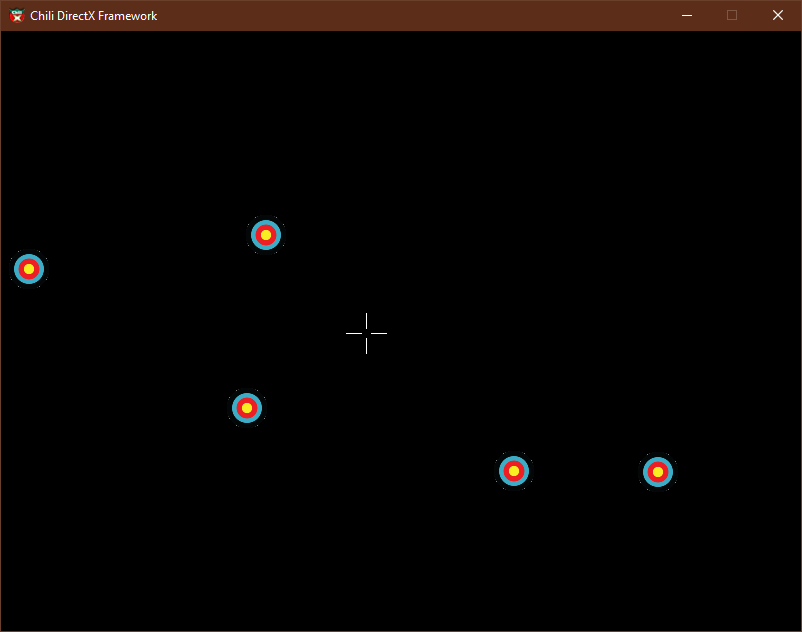

# DirectX 11 Game

A simple game made with DirectX 11 and Chili Framework (thanks to the amazing [ChiliTomatoNoodle](https://www.youtube.com/@ChiliTomatoNoodle)).

To run it, open it with Visual Studio (we used 2022) and build it. Or ask me for a pre-built executable (I will provide one soon).

You can play with keyboard or mouse.

Keyboard
Move: arrows keys
Shoot: spacebar

Mouse
Move: move mouse
Shoot: left click

Preview:

